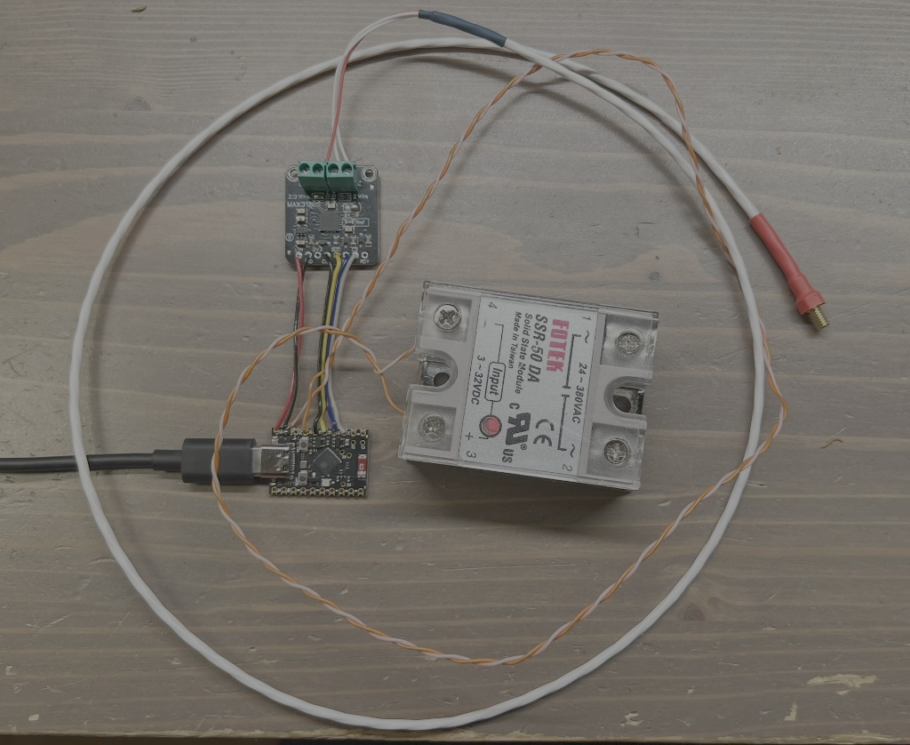
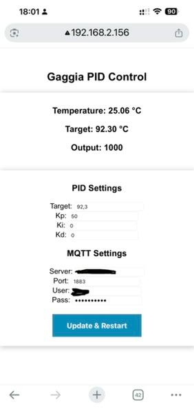
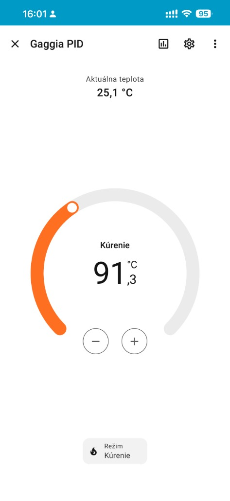
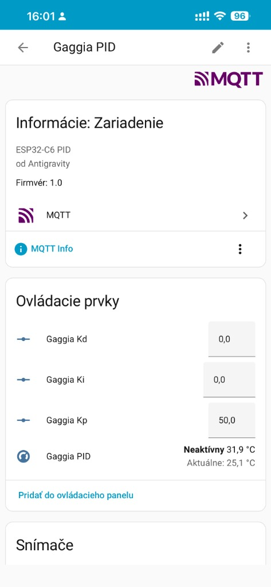

# Gaggia Classic PID Controller (ESP32-C6)

A fully featured PID controller firmware for the Gaggia Classic Espresso machine, built on the **ESP32-C6**. This project provides precise temperature control, a modern web interface for monitoring and tuning, and seamless integration with **Home Assistant** via MQTT.

## Features

- **PID Temperature Control**: Precise temperature management using the PID algorithm and `Adafruit_MAX31865` library for PT100 sensors.
- **Web Interface**: 
    - Real-time monitoring of Temperature, Target, and Power Output.
    - Tuning of **Kp, Ki, Kd** and **Target Temp** directly from the browser.
    - Mobile-friendly responsive design.
- **MQTT Integration**: 
    - Full two-way communication.
    - **Home Assistant Auto-Discovery**: Automatically creates Climate, Number, and Sensor entities.
    - Support for anonymous or authenticated brokers.
- **WiFiManager**: Easy initial WiFi setup via a Captive Portal (Access Point).
- **OTA Updates**: Flash new firmware wirelessly via the web interface.
- **Safety**: Built-in maximum temperature safety cutoff.

## Hardware Requirements

- **Microcontroller**: ESP32-C6 (e.g., ESP32-C6-DevKitC-1).
- **Sensor**: PT100 RTD Sensor with MAX31865 Amplifier module.
- **Relay**: Solid State Relay (SSR) 40DA (control: 3-32V DC, load: 24-380V AC).
- **Power Supply**: 5V Power Supply module (e.g., Hi-Link HLK-PM01).

### Pinout Configuration

| ESP32-C6 Pin | Function | Device |
| :--- | :--- | :--- |
| **GPIO 20** | SSR Control (+) | SSR |
| **GPIO 14** | SPI CS | MAX31865 |
| **GPIO 15** | SPI MOSI | MAX31865 |
| **GPIO 18** | SPI MISO | MAX31865 |
| **GPIO 19** | SPI SCK | MAX31865 |


*Wiring Diagram Implementation*

## Installation

### 1. Build & Flash
This project is built with **PlatformIO**.

1. Clone this repository:
   ```bash
   git clone https://github.com/petoz/gaggia_pid_esp32-c6.git
   cd gaggia_pid_esp32-c6
   ```

2. Build and Upload:
   ```bash
   pio run -t upload
   ```
   *Note: Ensure you are using the `pioarduino` platform fork if using ESP32-C6 with Arduino Core 3.x.*

### 2. Initial Setup (WiFi)
1. Power on the device.
2. Connect to the WiFi Hotspot named **`GaggiaPID_Setup`**.
3. A portal should open (or visit `192.168.4.1`). Configure your home WiFi credentials.

### 3. MQTT Setup
1. Open the Web Dashboard (find IP in router or serial monitor).
2. Enter your **MQTT Broker** details.
3. Click "Update & Restart".
4. Check Home Assistant integration page for the new **Gaggia PID** device.

## Usage

### Web Dashboard
Access `http://<DEVICE_IP>/` to:
- Monitor current temperature and heating status.
- Adjust PID parameters (Kp, Ki, Kd) and Target Temperature.


*Mobile Web Interface*

### Home Assistant
The device exposes the following entities:
- **Climate**: `climate.gaggia_pid` (Control Target Temp, Modes: Heat/Off).
    - **Off Mode**: Disables heating (Output = 0).
- **Number**: Tune Kp, Ki, Kd dynamically.
- **Sensor**: Monitor PID Output %.


*Climate Entity Control*


*Device Info & Tuning Controls*

## OTA Updates
Navigate to `http://<DEVICE_IP>/firmware` to upload a compiled `.bin` file (`.pio/build/<board>/firmware.bin`) for wireless updates.

## License
MIT License.
## License
MIT License.

---
*Built with [Antigravity](https://antigravity.google).*
